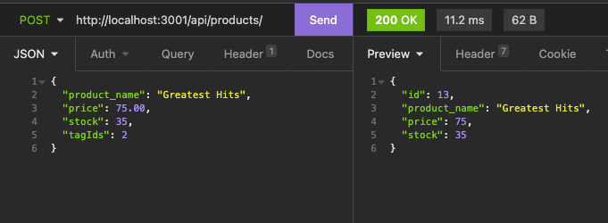

# E-Commerce Back-End

## Table of Contents:

- [Description](#description)
- [Usage](#usage)
- [Installation](#installation)
- [Link to GitHub Repo](#link-to-github-repo)
- [Screenshots](#screenshots)
- [Questions](#questions)

## Description

This app consists of a working back end, which can be used to track inventory for any company's e-commerce. With the addition of front end specs, a company is ready to start selling their products directly to consumers on the internet.

## Usage

This back end set up utilizes Express & SQL to build a database of categories, products, and tags for any company's inventory. The user can add, delete, or modify the inventory data by running the server and using the appropriate route (GET, POST, PUT, or DELETE).

## Installation

First, clone down the GitHub repo to your local machine. Then, run `npm i` in the terminal to install all the necessary node modules. Next, create the database listed in the schema folder. Then, modify the seed data (found in the seeds directory) to include the details of the user's inventory. You can then seed your database by running `npm run seed` in the terminal. Finally, all you need to do is run `npm run watch` to begin the server.

## Link to GitHub Repo

https://github.com/mfandel118/E-Commerce_Back-End

## Screenshot(s)

## Questions

Any additional questions about this project? Please feel free to reach out:

Marissa Fandel

- Email: mfandel118@gmail.com
- GitHub: https://github.com/mfandel118
